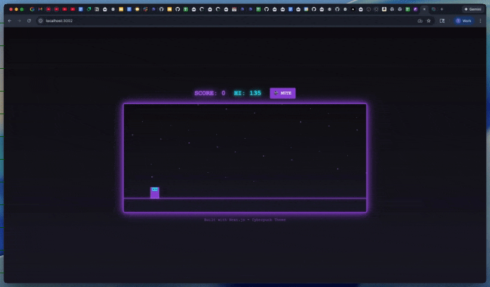

# 🎮 Vibe Knights

<div align="center">

### A Cyberpunk-Themed Endless Runner Game

## 🎥 Demo



*See Vibe Knights in action - autoplaying demo above!*

---

[](https://nextjs.org/)
[](https://reactjs.org/)
[](https://www.typescriptlang.org/)
[](https://tailwindcss.com/)
[](https://cline.bot)

</div>

## 🌟 About

**Vibe Knights** is a fast-paced cyberpunk runner game where you control a knight navigating through a neon-lit dystopian world. Jump over bars, duck under flying dragons, and rack up your high score in this addictive endless runner!

*Built live as a demonstration of AI-assisted development with [Cline CLI](https://cline.bot).*

## ✨ Features

- 🎨 **Stunning Cyberpunk Aesthetic** - Neon colors, grid floors, and atmospheric backgrounds
- 🎮 **Simple but Challenging Gameplay** - Easy to learn, hard to master
- 🐉 **Multiple Obstacles** - Jump over bars and duck under dragons
- 📈 **Progressive Difficulty** - Speed increases as you progress
- 🏆 **High Score System** - Compete against yourself with persistent high scores
- 🔊 **Sound Effects** - Immersive audio feedback (with mute option)
- 📱 **Responsive Design** - Works on desktop browsers
- 💾 **LocalStorage Persistence** - Your high score is saved locally

## 🎯 How to Play

### Controls

| Key | Action |
|-----|--------|
| `SPACE` / `↑` | Jump over bars |
| `↓` | Duck under dragons |
| `SPACE` | Start game / Restart after game over |

### Scoring

- **+10 points** for passing a bar
- **+15 points** for passing a dragon
- **Bonus sound effect** every 100 points!

## 🚀 Getting Started

### Prerequisites

- Node.js 18.x or higher
- npm, yarn, or pnpm

### Installation

1. **Clone the repository**
   ```bash
   git clone https://github.com/frontiertower/VibeCodingKnights.git
   cd VibeCodingKnights
   ```

2. **Install dependencies**
   ```bash
   npm install
   # or
   yarn install
   # or
   pnpm install
   ```

3. **Run the development server**
   ```bash
   npm run dev
   # or
   yarn dev
   # or
   pnpm dev
   ```

4. **Open your browser**
   
   Navigate to [http://localhost:3000](http://localhost:3000)

## 🛠️ Tech Stack

- **Framework**: [Next.js 14](https://nextjs.org/) - React framework with App Router
- **Language**: [TypeScript](https://www.typescriptlang.org/) - Type-safe JavaScript
- **Styling**: [Tailwind CSS](https://tailwindcss.com/) - Utility-first CSS framework
- **Canvas API**: HTML5 Canvas for game rendering
- **Audio**: Web Audio API for sound effects

## 📁 Project Structure

```
VibeKnightsGame/
├── app/
│   ├── globals.css          # Global styles and Tailwind config
│   ├── layout.tsx           # Root layout component
│   └── page.tsx             # Home page
├── components/
│   └── Game.tsx             # Main game component
├── lib/
│   ├── constants.ts         # Game constants and configuration
│   ├── game-objects.ts      # Knight, Bar, Dragon classes
│   └── sounds.ts            # Sound effects management
├── demo/
│   └── VibeCodingKnights.mp4  # Game demo video
└── README.md
```

## 🎨 Customization

Want to modify the game? Here are some key files:

- **`lib/constants.ts`** - Adjust game speed, obstacle gaps, colors, and dimensions
- **`lib/game-objects.ts`** - Modify Knight, Bar, and Dragon behavior
- **`components/Game.tsx`** - Change game mechanics and UI
- **`app/globals.css`** - Customize cyberpunk theme colors

## 📦 Build for Production

```bash
npm run build
npm start
```

This will create an optimized production build and start the production server.

## 🤝 Contributing

Contributions, issues, and feature requests are welcome! Feel free to check the issues page.

## 📝 License

This project is open source and available under the MIT License.

## 🎮 Credits

Built with ❤️ using Next.js and Canvas API

**🤖 Development**: This game was created live as a demonstration using [Cline CLI](https://cline.bot) - an AI coding assistant that helps developers build faster.

---

<div align="center">

**Enjoy the game? Give it a ⭐️!**

</div>